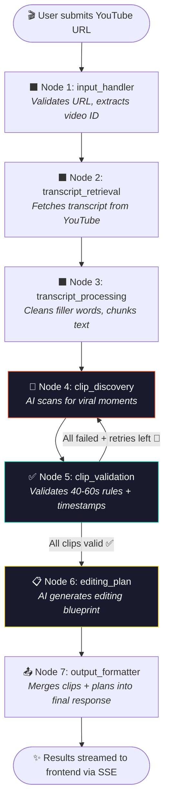
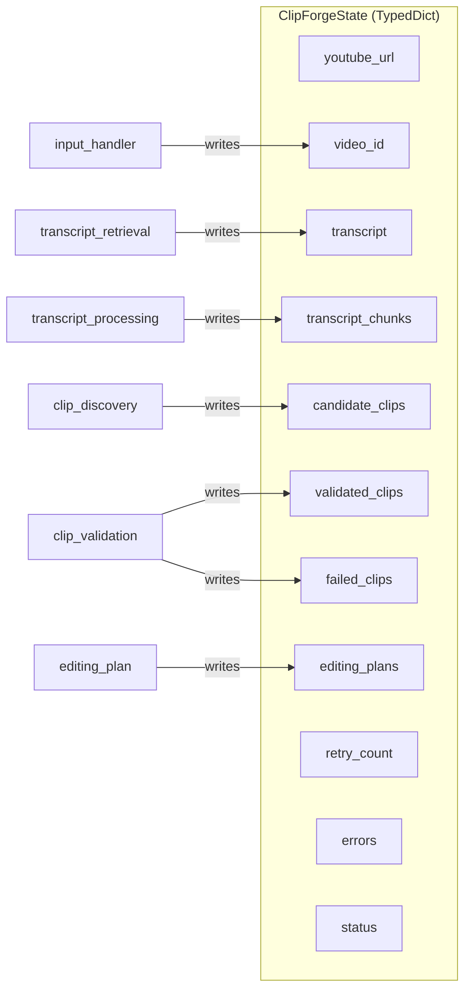
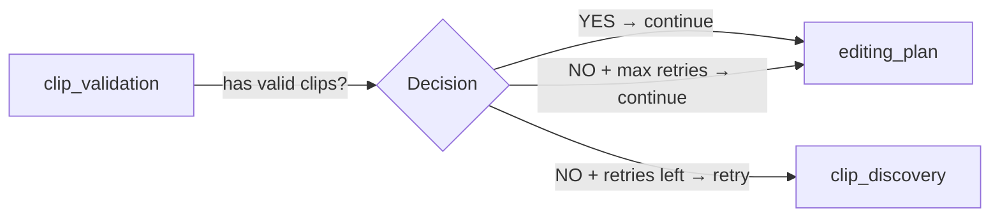
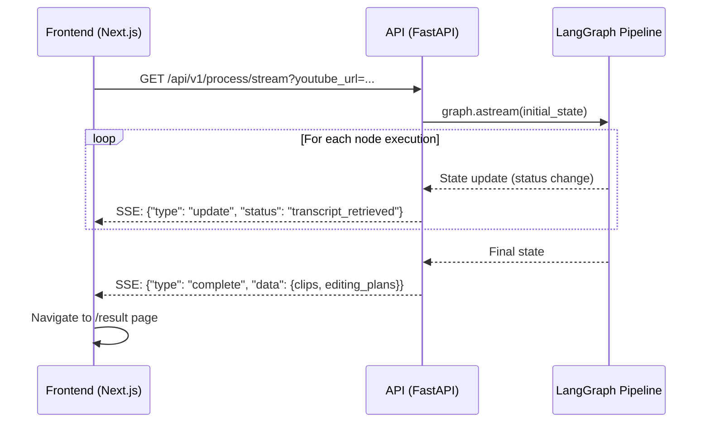
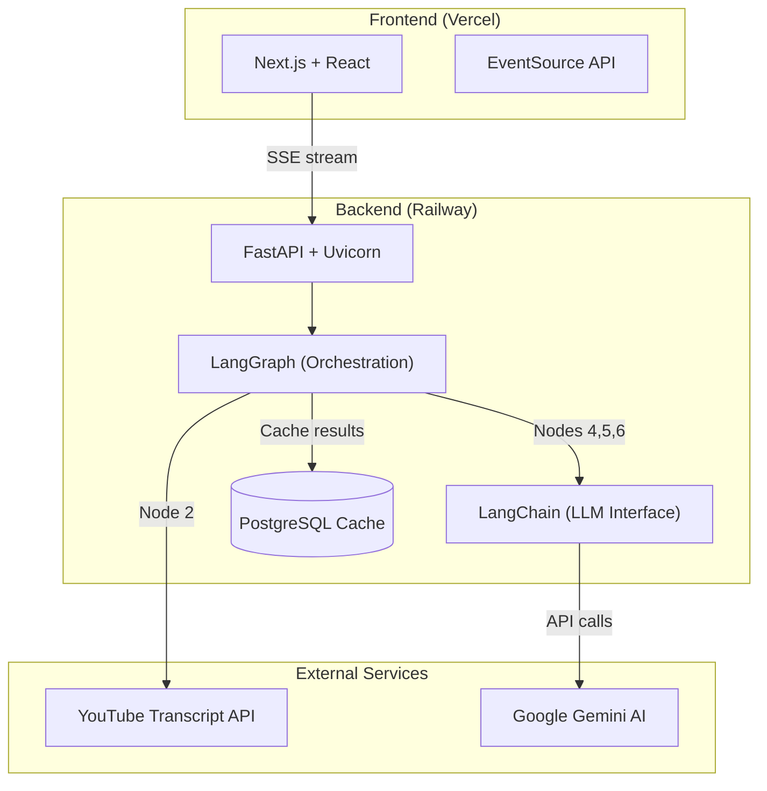

# ClipForge AI — LangGraph Pipeline Deep Dive

## The Big Picture

ClipForge uses **three technologies** that work together like layers of a cake:

| Layer | Technology | Role |
|-------|-----------|------|
| **Orchestration** | **LangGraph** | Controls _what happens when_ — defines the node graph, edges, and retry logic |
| **LLM Interface** | **LangChain** | Talks to the AI model — sends prompts, parses structured outputs |
| **LLM Model** | **Google Gemini** | The actual AI brain that understands text and finds viral clips |

> Think of it as: **LangGraph** is the assembly line, **LangChain** is the robot arm, and **Gemini** is the brain.

---

## Node Graph — How It Flows



---

## What Each Node Does

### ⬛ Node 1 — `input_handler` ([nodes.py:29](../backend/app/graph/nodes.py#L29))
**Purpose:** Validates the YouTube URL and extracts the video ID.

```
Input:  state.youtube_url = "https://youtube.com/watch?v=abc123"
Output: state.video_id = "abc123", state.status = "input_validated"
```
No AI involved — just regex parsing.

---

### ⬛ Node 2 — `transcript_retrieval` ([nodes.py:53](../backend/app/graph/nodes.py#L53))
**Purpose:** Fetches the full transcript from YouTube using `youtube-transcript-api`.

```
Input:  state.video_id = "abc123"
Output: state.transcript = [{text: "...", start: 0.0, duration: 5.2}, ...]
```
No AI — uses the `youtube-transcript-api` Python library.

---

### ⬛ Node 3 — `transcript_processing` ([nodes.py:84](../backend/app/graph/nodes.py#L84))
**Purpose:** Cleans the raw transcript (removes filler words like "um", "uh"), merges speaker segments, and chunks the text into overlapping windows.

```
Input:  state.transcript = [{text: "um so basically...", ...}, ...]
Output: state.transcript_chunks = ["chunk 1 (40-60s of text)...", "chunk 2...", ...]
```
No AI — pure Python text processing.

---

### 🤖 Node 4 — `clip_discovery` ([nodes.py:118](../backend/app/graph/nodes.py#L118))
**Purpose:** This is where LangChain + Gemini kick in. Sends transcript chunks to the AI and asks:
> _"Find the most viral 40-60 second clip in this text. Look for strong hooks, counterintuitive takes, emotional moments, and cliffhangers."_

```
Input:  state.transcript_chunks = ["chunk1...", "chunk2...", ...]
Output: state.candidate_clips = [{clip_text, start_time, end_time, virality_score, hook, payoff}, ...]
```

**How it works internally:**
1. `get_llm_client()` creates a `ChatGoogleGenerativeAI` instance (LangChain)
2. The agent sends a structured prompt with transcript chunks
3. Gemini returns structured JSON with clip candidates
4. Results are cached in memory per video ID for "Load More" requests

---

### ✅ Node 5 — `clip_validation` ([nodes.py:204](../backend/app/graph/nodes.py#L204))
**Purpose:** Validates each discovered clip against strict rules:
- Duration must be 40-60 seconds
- Timestamps must exist in the real transcript
- Text must match actual transcript content

```
Input:  state.candidate_clips = [{clip_text: "...", start_time: 120.0, ...}]
Output: state.validated_clips = [...], state.failed_clips = [...]
```

**Retry Logic:** If ALL clips fail validation and retries remain, the graph loops BACK to Node 4 (clip_discovery) to try again.

---

### 📋 Node 6 — `editing_plan` ([nodes.py:267](../backend/app/graph/nodes.py#L267))
**Purpose:** For each validated clip, asks Gemini to create a detailed editing blueprint:
> _"Generate a frame-perfect editing plan: cut points, caption suggestions, B-roll cues, music fade points, and platform-specific tips."_

```
Input:  state.validated_clips = [{clip_text: "...", ...}]
Output: state.editing_plans = [{clip_index: 0, raw_plan: "0:00-0:03 HOOK: Jump cut to..."}, ...]
```

---

### 📤 Node 7 — `output_formatter` ([nodes.py:308](../backend/app/graph/nodes.py#L308))
**Purpose:** Merges validated clips with their editing plans into the final response format.

```
Input:  state.validated_clips + state.editing_plans
Output: state.status = "completed"
```

---

## The Shared State

All 7 nodes share a single `ClipForgeState` object ([state.py](../backend/app/graph/state.py)). Each node reads what it needs and writes its outputs back:



---

## The Conditional Retry Loop

This is what makes LangGraph special — it's not just a linear chain. There's a **conditional edge** after validation:

```python
# workflow.py:29-51
def should_retry_validation(state):
    if validated_clips or retry_count >= max_retries:
        return "continue"    # → editing_plan
    if failed_clips and retry_count < max_retries:
        return "retry"       # → clip_discovery (loop back!)
    return "continue"
```



This means the AI gets **multiple chances** to find good clips if the first attempt produces invalid results.

---

## How SSE Streaming Works

The frontend doesn't wait for the entire pipeline to finish. Instead, it uses **Server-Sent Events** to receive real-time updates:



The key line is in [routes.py:147](../backend/app/api/routes.py#L147):
```python
async for state in graph.astream(initial_state, stream_mode="values"):
    yield f"data: {json.dumps({'type': 'update', 'status': status})}\n\n"
```

---

## Technology Stack Summary



| What | Technology | Why |
|------|-----------|-----|
| **LangGraph** | Directed graph engine | Lets us define nodes, edges, conditional loops, and stream state updates in real-time |
| **LangChain** | LLM abstraction layer | Provides `ChatGoogleGenerativeAI` — handles prompt formatting, structured output parsing, retries, and token management |
| **Google Gemini** | Large Language Model | The AI that actually reads transcripts and identifies viral moments / generates editing plans |
| **FastAPI** | Web framework | Serves the SSE stream and REST endpoints |
| **youtube-transcript-api** | Python library | Fetches real transcripts from YouTube (no AI needed) |
